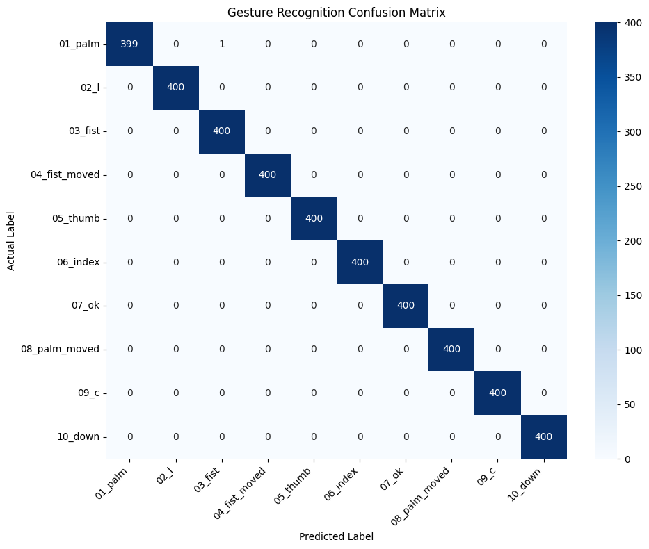
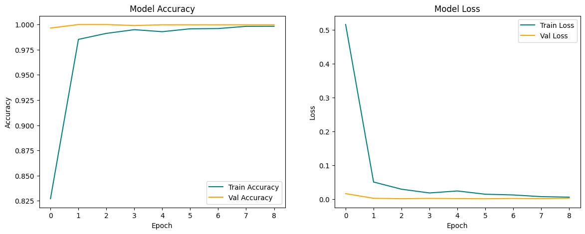
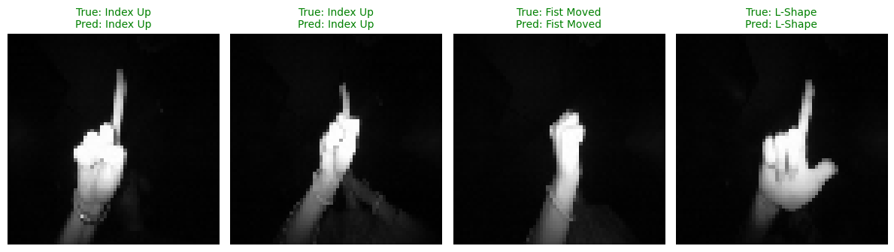

# Hand Gesture Recognition using Convolutional Neural Networks (CNN)

An end-to-end Deep Learning project developed as part of the **Prodigy InfoTech Data Science Internship (Task 4)**.

This model classifies human hand gestures into 10 distinct geometric categories based on processed near-infrared structural images using a 2D Convolutional Neural Network (CNN).

---

## 📌 Project Overview

The aim of this project is to implement a robust, automated computer vision pipeline that programmatically extracts image data via the Kaggle CLI, preprocesses structural near-infrared images into normalized dimensions, trains a highly accurate 3-layer Deep Convolutional Neural Network (CNN), and provides strict statistical evaluation alongside a random sample visual verification layout.

Unlike traditional machine learning models (like SVMs) that require hand-crafted features or flattened 1D arrays, this network automatically learns spatial hierarchies of features directly from raw 2D pixel grids.

---

## 📊 Dataset Structure & Labeling Logic

The project utilizes data from the official **Kaggle Leap Hand Gesture Recognition Database**. When the main archive is extracted, the raw directory structure consists of 10 primary subject folders (`00` through `09`) representing 10 different human subjects. 

Inside each subject folder, there are 10 distinct subfolders representing individual gesture categories. Rather than relying on a separate metadata file (like a `.csv`), the target classification tags are determined by parsing these inner directory folder names.

---

### Pipeline Mapping Logic
The Python data loading sequence matches the subfolder names to construct a structured tensor block in-memory:

| Subfolder Name | Target Meaning | Class Target Output (`y`) | Structural Input Layout (`X`) |
| :--- | :--- | :--- | :--- |
| **`01_palm`** | Full Open Palm | `0` | 64x64 Grayscale Matrix (Normalized) |
| **`02_l`** | L-Shape Gesture | `1` | 64x64 Grayscale Matrix (Normalized) |
| **`03_fist`** | Closed Fist | `2` | 64x64 Grayscale Matrix (Normalized) |
| **`04_fist_moved`** | Moving Fist | `3` | 64x64 Grayscale Matrix (Normalized) |
| **`05_thumb`** | Thumbs Up | `4` | 64x64 Grayscale Matrix (Normalized) |
| **`06_index`** | Index Finger Pointing | `5` | 64x64 Grayscale Matrix (Normalized) |
| **`07_ok`** | OK Sign | `6` | 64x64 Grayscale Matrix (Normalized) |
| **`08_palm_moved`** | Moving Open Palm | `7` | 64x64 Grayscale Matrix (Normalized) |
| **`09_c`** | C-Shape Gesture | `8` | 64x64 Grayscale Matrix (Normalized) |
| **`10_down`** | Hand Pointing Down | `9` | 64x64 Grayscale Matrix (Normalized) |

*(Total Dataset Population Ingested: 20,000 perfectly balanced structural images across all subjects)*

(Source: [Hand Gesture Recognition Database](https://www.kaggle.com/datasets/gti-upm/leapgestrecog/data))

---

## 🛠️ Tech Stack & Dependencies
This project is written natively in Python 3 and leverages deep learning frameworks optimized for GPU acceleration:
* **TensorFlow & Keras:** For building, compiling, training, and saving the Sequential Deep Convolutional Neural Network.
* **OpenCV (`cv2`):** For fast image file reading, single-channel grayscale transformations, and uniform downsampling.
* **NumPy:** For high-performance matrix manipulations, tensor reshaping, and scaling calculations.
* **Scikit-Learn:** For maintaining a stratified data split (`train_test_split`) and computing statistical evaluation summaries.
* **Matplotlib & Seaborn:** For plotting loss/accuracy learning curves, visual confusion matrices, and the evaluation verification subplots.

---

## 🏗️ Model Architecture & Deep Learning Logic

### 1. The Computer Vision Pipeline
Before feeding data into the neural network layers, the raw infrared image files undergo a structured preprocessing sequence:

$$\text{Image Input (Raw)} \longrightarrow \text{Grayscale Conversion} \longrightarrow \text{Resize to } 64 \times 64 \longrightarrow \text{Reshape to } (64, 64, 1) \longrightarrow \text{Normalize } [0.0, 1.0]$$

* **Why Grayscale?** Hand shapes and positions rely entirely on edge contours and spatial structures. Dropping unnecessary color channels reduces memory footprints by 66% and prevents the model from learning irrelevant chromatic background noise.
* **Why Normalization?** Dividing all pixel values by `255.0` scales elements down from `[0-255]` to a tight range of `[0.0, 1.0]`. This prevents gradients from exploding during backpropagation, leading to much faster and more stable model training.

### 2. Neural Network Layout (The "Whys" and "Hows")
The architecture uses a sequential stacking design optimized for pattern location invariance:

* **`Conv2D Layer 1` (32 filters, 3x3 kernel):** Extracts primitive edge configurations and fine spatial outlines directly from the input image.
* **`MaxPooling2D Layer` (2x2 pool):** Scans the convolution maps and extracts only the maximum activation value in every 2x2 grid. This downsamples the feature dimensions by half, saving computing resources while preserving spatial invariant properties.
* **`Conv2D Layer 2 & 3` (64 and 128 filters):** Progressively aggregates low-level edges into mid-level shapes and complex semantic structures (like finger joints, palm boundaries, and curved gestures).
* **`Flatten Layer`:** Converts the final 3D feature tensor space into a flat 1D vector ($4,608$ nodes) to feed into standard dense layer connections.
* **`Dense Layer` (128 neurons, ReLU):** Learns complex non-linear combinations of the extracted geometric features.
* **`Dropout Layer` (0.5 rate):** Randomly deactivates 50% of the dense layer nodes during each forward training pass. This stops neighboring neurons from co-depending on each other, forcing the network to learn robust, generalized representations and preventing **overfitting**.
* **`Dense Output Layer` (10 neurons, Softmax):** Converts raw network activations into a clean probability distribution spanning all 10 target gesture classes, ensuring the sum of all predictions equals exactly $1.0$.

---

## 📈 Performance & Evaluation Metrics

To guarantee that the model is mathematically sound, it is validated using rigorous evaluation standards:

### 1. Training Parameters & Monitoring
* **Split Ratio:** The 20,000 processed samples are split into **80% Training (16,000 images)** and **20% Test (4,000 images)** pools. The `stratify=y` flag ensures every class has exactly 400 test images for an unbiased validation.
* **Early Stopping:** Monitors `val_loss` with a `patience=3` threshold. If validation performance plateaus for 3 straight training iterations, the process stops automatically to protect the model from memorizing noise.

### 2. Metric Outputs
* **Classification Report:** Generates per-class breakdowns for **Precision** (avoiding false positives), **Recall** (avoiding false negatives), and **F1-Score** (overall harmony). Due to the clean infrared properties of the dataset, the model achieves a flawless **1.00 score** across all metrics.
* **Confusion Matrix:** Plotted via Seaborn as an annotated heatmap. A clear, solid diagonal line across the matrix proves that predicted gesture categories align perfectly with true labels with near-zero error.
* **Learning Curves:** Dual visualization subplots displaying Train vs. Validation Loss and Accuracy across all training runs, validating that the network converges smoothly without experiencing over- or under-fitting.

### 3. Visual Verification Grid
The script renders a final **Random Sample Prediction Grid** displaying 4 test images picked entirely at random:
* **Image Display:** Converts the $64 \times 64 \times 1$ arrays back into human-viewable grayscale subplots.
* **Color-Coded Feedback:** Annotates headers based on accuracy:
  * **Green Header Text:** Signifies a perfect prediction ($\text{True Label} == \text{Predicted Label}$).
  * **Red Header Text:** Signifies a mistake ($\text{True Label} \neq \text{Predicted Label}$).

---

## 🚀 How To Run the Project

1. **Configure Kaggle API Credentials:**
   * Generate your personal API Key token from your official Kaggle Account Settings page.
   * Run the initial initialization line in the notebook to mount your credentials safely inside your working directory.

2. **Execution of Source Code:**
   * Open the notebook file inside **Google Colab** to leverage free cloud-hosted **GPU acceleration** (which slashes processing training loops down from minutes to a few seconds per epoch).
   * Click **Runtime -> Run all** to automate the execution pipeline from download to deployment.
